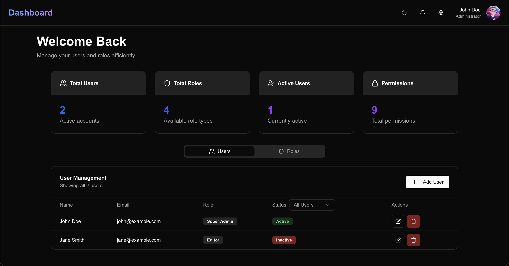

# Role-Based Access Control Dashboard

A modern, responsive dashboard for managing user roles and permissions built with Next.js 14, Tailwind CSS, and Shadcn UI components.



## Features

### User Management
- Create, edit, and delete user accounts
- Assign roles to users
- Track user status (Active/Inactive)
- Responsive user table with sorting and filtering

### Role Management
- Create and customize roles with specific permissions
- Hierarchical permission structure
- Pre-configured roles
- Granular access control settings

### Modern UI/UX
- Clean, intuitive interface
- Responsive design for all devices
- Smooth animations and transitions
- Dark and Light Theme

## Tech Stack

- **Framework**: Next.js 14
- **Styling**: Tailwind CSS
- **UI Components**: Shadcn UI
- **Animations**: Framer Motion
- **Icons**: Lucide Icons
- **State Management**: React Hooks

## Getting Started

### Prerequisites

- Node.js 18+ 
- npm or yarn

### Installation

1. Clone the repository:
```bash
git clone https://github.com/vanshgulati16/role-based-access-control-ui.git
cd role-based-access-control-ui
```

2. Install dependencies:
```bash
npm install
# or
yarn install
```

3. Start the development server:
```bash
npm run dev
# or
yarn dev
```

4. Open [http://localhost:3000](http://localhost:3000) with your browser to see the result.

## Project Structure

```
├── app/                  # Next.js app directory
├── components/          # React components
│   ├── ui/             # Shadcn UI components
│   ├── Dashboard.jsx   # Main dashboard component
│   ├── Navbar.jsx      # Navigation component
│   ├── UserModal.jsx   # User management modal
│   └── RoleModal.jsx   # Role management modal
├── lib/                # Utility functions
└── public/             # Static assets
```

## Available Scripts

- `npm run dev` - Start development server
- `npm run build` - Build for production
- `npm start` - Start production server

## Role Types

1. **Super Admin**
   - Full system access
   - User and role management
   - System settings control

2. **Content Manager**
   - Content creation and management
   - User activity monitoring
   - Analytics access

3. **Editor**
   - Content creation and editing
   - Basic analytics access

4. **Viewer**
   - Read-only access
   - Basic analytics viewing

## Permission Categories

### User Management
- Manage Users
- Manage Roles

### Content Management
- Create Content
- Edit Content
- Delete Content
- Approve Content
- View Content

### Analytics & Settings
- View Analytics
- Manage Settings


## License

This project is licensed under the MIT License - see the [LICENSE.md](LICENSE.md) file for details.

## Acknowledgments

- [Next.js](https://nextjs.org/)
- [Tailwind CSS](https://tailwindcss.com/)
- [Shadcn UI](https://ui.shadcn.com/)
- [Framer Motion](https://www.framer.com/motion/)
- [Lucide Icons](https://lucide.dev/)

